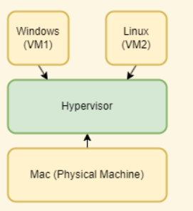

## Virtual Machine vs Container

**Virtual Machine:** An abstraction of a machine(physical hardware). Using hyperviser to run virtual machines.

* Each VM needs a full-blown OS
* Slow to start
* Resourse intensive

**Container:** An isolated environment for running an application

* Allow running multiple apps in isolation
* Are lightweight
* Use OS of the host
* Start quickly
* Need less hardware resources

## Docer Architecture

A container is like a process

All container share the OS of the host

