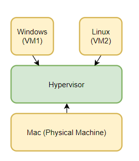
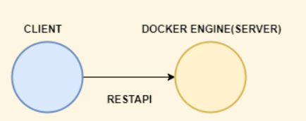
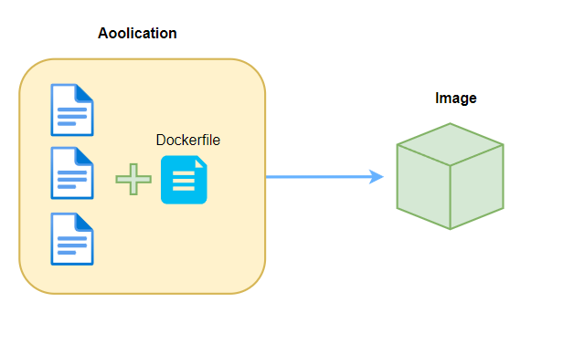
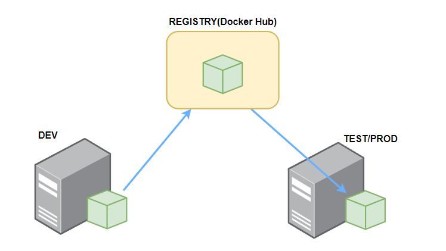

## Virtual Machine vs Container

**Virtual Machine:** An abstraction of a machine(physical hardware). Using hyperviser to run virtual machines.



* Each VM needs a full-blown OS
* Slow to start
* Resourse intensive

**Container:** An isolated environment for running an application

* Allow running multiple apps in isolation
* Are lightweight
* Use OS of the host
* Start quickly
* Need less hardware resources

## Docer Architecture

**Container:**
A container is like a process
All container share the OS of the host (share the kernel of the host)
**Kernel:**
A kernel is the core of the OS, it manages applications and hardware resources.
Every OS has its own kernel/engine. Different Kernel has different APIs



## Development Workflow

Dockerize an application



Dockerfile is a file contains all the instruction that docker uses to package an application into an image.

Image:

* A cut-down OS
* A runtime environment (eg Node)
* Application files
* Third-party libraries
* Environment variables

Ask docker to start a **container** to use that **image**.

Container is a special process has its own file system provided by the image.



## Linux Distributions

Ubuntu

```
docker run ubuntu

docker ps
<!-- show the latest running process(container) -->

docker ps -a
<!-- for all -->

docker run -it ubuntu
<!-- start a container in interactive mode -->

echo

whoami
<!-- show the current -->

echo $0
<!-- location of the shell program -->

history
<!-- show the history of the command used lately -->
!3
<!-- use the the third command used in history -->
```

## **Managing Packages**

**package manager:**
npm
yarn
pip
.....

In ubuntu use `apt`

```
Most used commands:
  list - list packages based on package names
  search - search in package descriptions
  show - show package details
  install - install packages
  reinstall - reinstall packages
  remove - remove packages
  autoremove - Remove automatically all unused packages
  update - update list of available packages
  upgrade - upgrade the system by installing/upgrading packages
  full-upgrade - upgrade the system by removing/installing/upgrading packages
  edit-sources - edit the source information file
  satisfy - satisfy dependency strings
```

use `apt update` and then `apt install`
using `ctrl + L` to clean the window

## Linux File System

`root` folder on top of the hierarchy:
    `bin`,  `lib`,  `dev`, `home`(div for devices)....

In linux, everything is a file

**Navigating**

```
pwd
ls

cd ~
<!-- back to root directory -->
mv
<!-- rename files or folders or move them somewhere else -->
touch
<!-- create new file (can create multiple files in one go)-->

ctrl+W
<!-- delete in one go -->

rm
<!-- remove files -->

rm -r
<!-- remove directories -->

cat
<!-- show the content -->
more
<!-- show part of the content -->
less
<!-- press up and down arrows and press q to quite -->
head -n 5
<!-- show the first five lines -->
tail -n 5
<!-- show the last five lines -->

cat file1.txt > file2.txt
<!-- redirect the file -->
cat file1.txt file2.txt >combined.txt
echo hello > hello.txt
```
less

